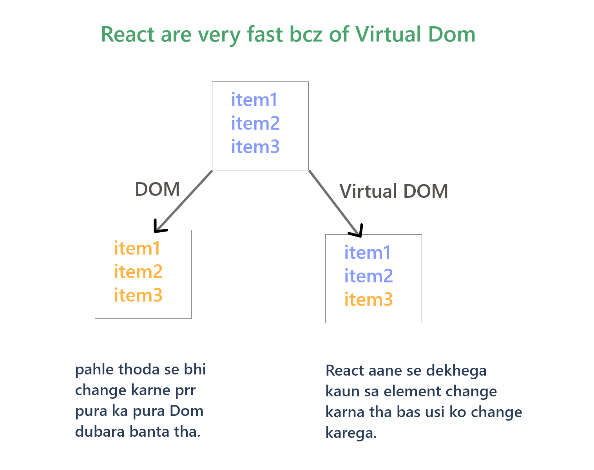
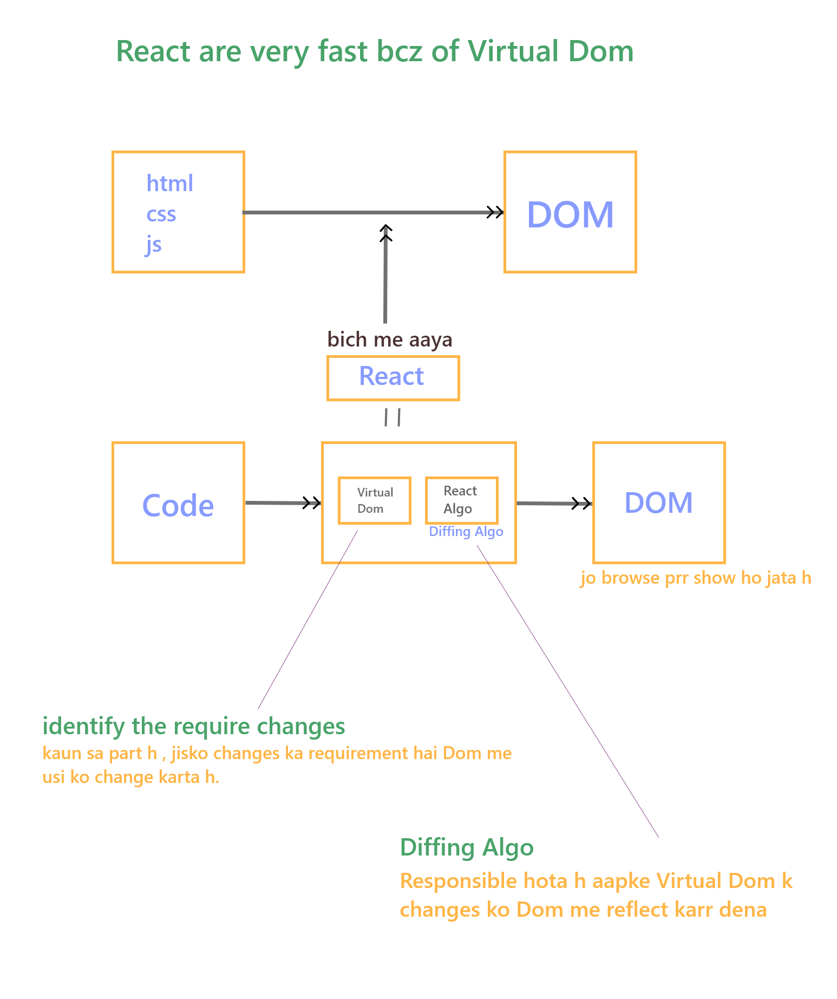

# React
   
   - React is Fronted library,
    which is used to build fast & efficient UI/UX.

   - It is develop by FB/Meta. 

### why React ?

  - very Fast.

           
   

   

  - easy event handling
        
        eg. addEventListner() : DOM me 

         - sortcut provide karta react  

   - it's small library.

         It's easy to learn  

   - It manage UI by state.

   - react uses something called as Virtual Dom.    

   -------------------------------------     

#### Framework:
     
       ek particular tools jisme sari chije mil jati h. 
       kisi chij prr dependency jiski kam ho wo hota h Framework. 

 #### Library:  

     Jisaki dependency jada ho , uske liye aapko tools dhudhane padegen , 
     uske liye aapko cheeje install karni padegi wo hoti h Library.   