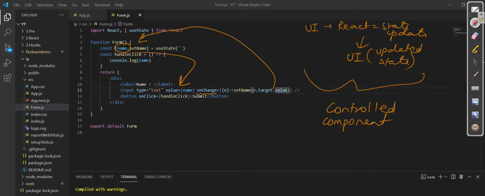
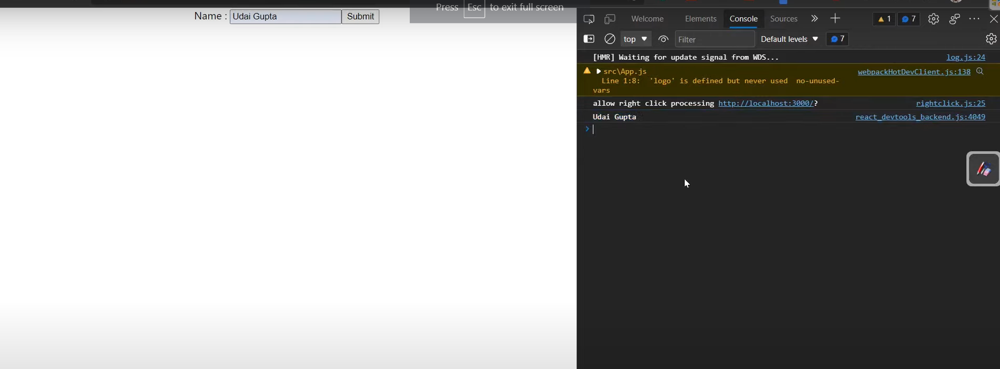
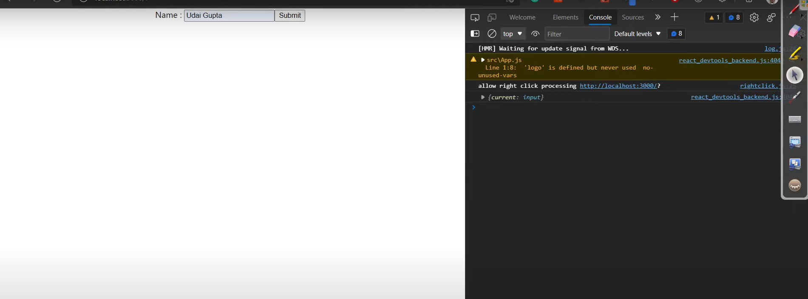
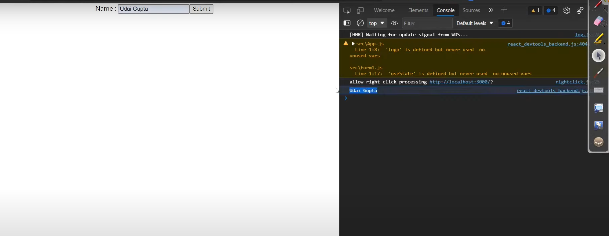
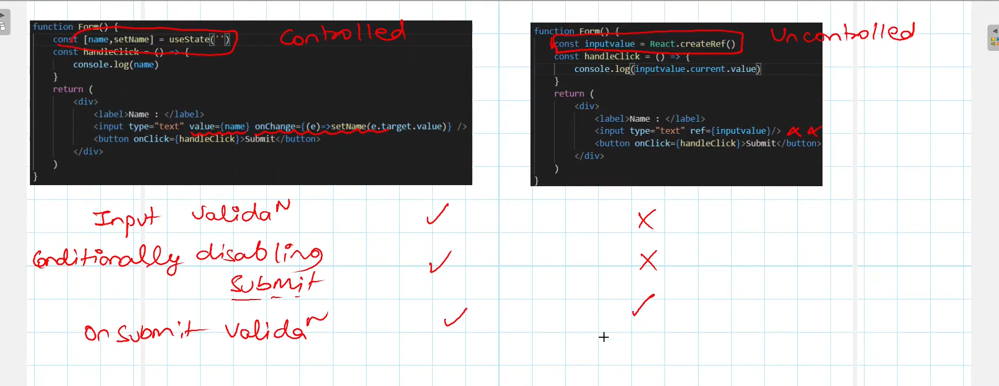

### Controlled and UnControlled component :
------------------------------------------------

#### Controlled Component : [ track rakhate hai ]


- state update huyi wo apne UI ko di , 
- *kisi bhi component ko validated kar sakta hu that is called controlled component. 
- control Component par validation lga sakta hu ki 

   if name.length > 3 then "submit" 
   
   if name.length < 3 then "submit disable"


  i.e  strong password set karne k bad hi next page prr ja sakte hai.

```js
# App.js :
====================

import Form from './Form';

function App(){
    return(
        <Form/>
    )
}

export default App;


# Form.js :
====================

import React,{useState} from 'react


function Form(){

    const [name,setName] = useState('')
   
   const handleClick = () =>{
        console.log(name)
    }


    return(
         <>
          <lable>Name: </lable>
          <input type="text" value={name} onChange={(e)=>setName(e.target.value)}/>
          <button onClick={handleClick}>submit</button>
         </>
    )
}

export default Form
```



     
     


#### UnControlled Component : [ track nhi rakhate ]
---------------------------------
- *yha validation nahi lga sakte bcz yha par hamne koi track nhi rakha ,
  input me koi value store nhi karayi with onClick ,
  hamne direct refrance store kra


- diadvantage :
  i.e mana input me "name" ki length grater than 3 ho toh hi submit ho ,
  par yha nhi kar sakte bcz mai value ko track nhi kar rha 

- advantage :
   hamne apni memory bachayi bcz hamne "state" me value store nhi kra rhe ,
   hamne yha par koi track nhi rakha

```js
# App.js :
====================

import Form1 from './Form1';

function App(){
    return(
        <Form1/>
    )
}

export default App;


# Form.js :
====================

import React,{useState} from 'react


function Form1(){

   // value di uncontrolled comp me
   const inputVal = React.createRef()
   
   
   const handleClick = () =>{
       // console.log(inputVal)  // esse HTML ka tag pura ka pura aa jayega
       console.log(inputVal.current.value);
    }


    return(
         <>
          <lable>Name: </lable>
          <input type="text" ref={inputVal}}/>
           <button onClick={handleClick}>submit</button>
         </>
    )
}

export default Form1
```




# Note :

Controlled Component  
---------------------- 
- *yha state create karte hai taki variable me value store kar sake 
   
     const [ name , setName ] = useState('') 

- *yha input par validation 

- yha onChange ka event lga rhe 
  taki value ko update kar sake

-  *yha track rakhate hai

-  *onSubmit validation yha kar sakte hai 

- *conditionally disability submit
   i.e strong password set karne k bad aap next page par ja sakte hai


UnControlled Component 
------------------------
- *yha ham ref create karate hai 
   
     const inputVal = React.createRef()

- *yha input ka validation nhi karte  = ✖

- yha koi event nhi lagate 
  yha value update ka kam nhi karte

- *yha track nhi rakhate   

- *onSubmit validation yha bhi kar sakte hai 

- *conditionally disability submit = ✖





