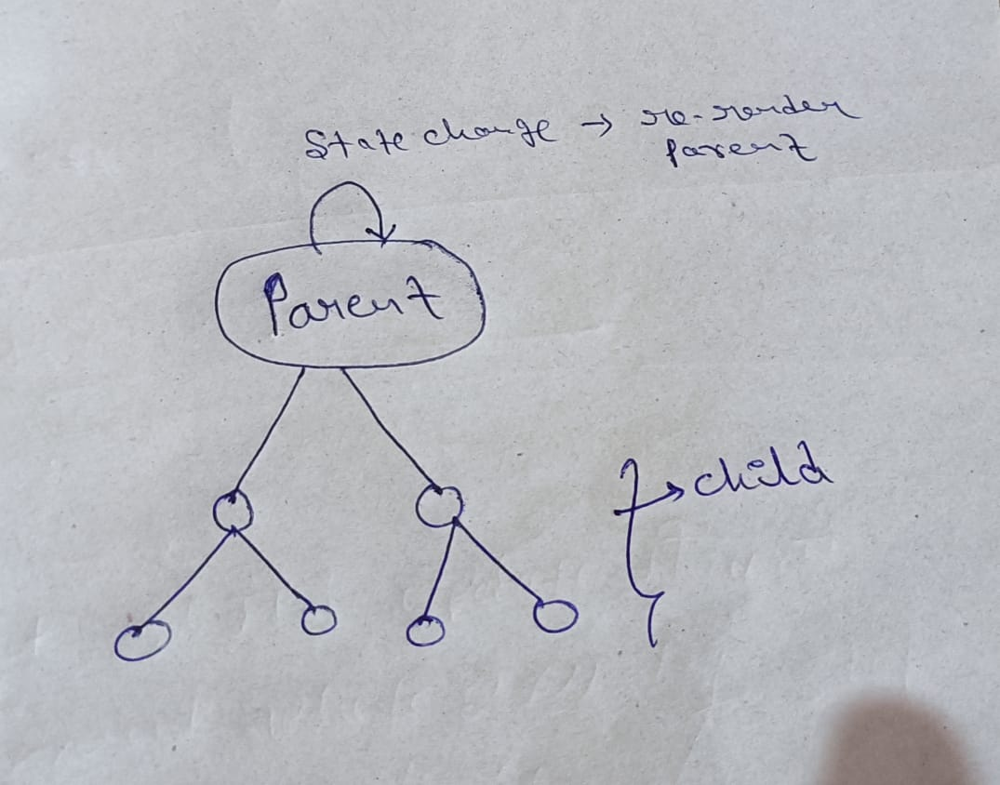
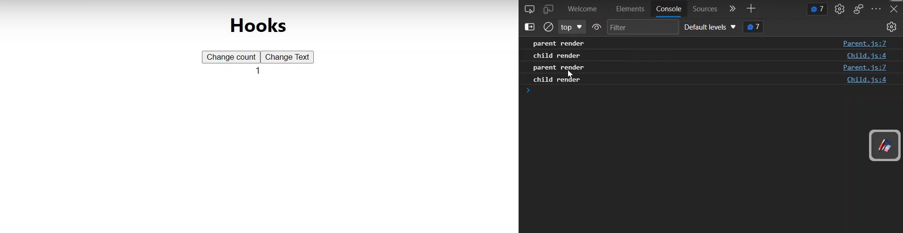

### padhane k liye website : 
  - Reactjs.org    
  - logRocket 

[reactjs-interview-questions](https://github.com/sudheerj/reactjs-interview-questions)

### machine round interviews questions 
[machine round interviews questions ](https://github.com/sadanandpai/frontend-mini-challenges)

### Frontend interview checklist & roadmap
[Frontend interview checklist & roadmap](https://github.com/sadanandpai/frontend-learning-kit/blob/main/public/2023_FE_roadmap.pdf)

# react-interviews-question :

## Topic :
- Lifecycle method
- Memoization
- PropTypes

### Lifecycle method in react : 
------------------------------------
- sideEffect wale kam kar k deta hai class component me.  i.e API call
- Three phases : (In class)

     - mounting(creation)   : 
       - aapka component aapke Dom par add huaa
           
              constructor() => render => componentDidMount
     - updating(updation)  :  
        - state change/update huyi toh component update huaa
             
              render => componentDidUpdate  
     - unmounting(delete) : 
        - Dom se nikal rhe
        - jab component hat rha hoga hamari Dom se toh uss se just pahle hi ye method call ho jayega.

               componentWillUnMount 


#### In functional component :

   - lifecycle wala kam function component me "Hook" k aane se "useEffect()" se solve karte h
   - side effect wale kam jisame hme wait karna pad sakta hai, wo kam hmm 
     functional component m "useEffect()" se handle karte hai. 

        - useEffect(fun) :
           
           - execute always after first render
        
        - useEffect(fun , [ ]) :
             
             - execute only once
        
        - useEffect(fun , [...parameter...]) :
            
             - unn parameters k , conditionally after first render


#### note:
    
    1- componentDidMount   ====alternate====>   useEffect(fun,[ ])

    2- useEffect(fun) => eska alternate class component m nhi hota.
    
######
-----------------  


#### componentDidMount :
  - side effect wale kam, jisme hme wait karna pad sakta hai , wo kam componentDidMount handle karta hai [In class component]. 
  - yah ek esa method hai jo constructor , render aur sari chije chal jane k bad last me
    chalega aur last me jitne bhi side effect wale kam matlab jin kam ko hone me time lag
    sakta hai, jin kamo se hame data lana hota hai , jo kam hamare system/application ko
    slow kar sakta hai , wo sare kamo ko bad me ja kar karta hai.
  
  ```js
   class Component extends React.Component{
      constructor(){

     
      }

      componentDidMount(){

     
      }

      render(){

      
      }

   }


   // pahle constructor chalega then render then componentDidMount.
  ```

  - API calls => jisme hame wait karna pad sakta hai ,
    1 sec / 2 sec / 3 sec me data aayega.
    jisme hme async- await lagana padega.

  ```js
    async componentDidMount(){ // lifecycle me ek bar chalta hai aur data la kar de deta hai.

          const res = await axios.get(`.......`)
      
          let mData = res.data
      
          console.log(mData)
    }


   
   // axios ek promised libery hai toh esko promise k term me likhana thoda complex 
   // hota hai , toh kyun na async-await use kar liya jaye.

   // jisme hame wait karna pad rha ki data 1 sec / 2 sec / 3 sec me data aayega.
  //  toh hme async- await use kiya. componentDidMount k sath.

  // axios : server par request k liye
  ```  
  
#### Hooks : (In fun comp)

- they let you use state and other react features without writting a class.
  
  - useState()
    
    - functional component m "state" manage/define karne k liye hooks ka use karte hai.
      
           import React,{useState} from 'react' 

           
           const [count,setCount] = useState(0)

           const [text,setText] = useState('')

           
            // count : jisko manipulate karna hai
           // setCount : yha par ek function pass karte hai, jiski madad se hamko count ko manipulate karna hai.
          // yha "count" ki `bydefault` "value = 0" set huyi hai
          
          // count par koi bhi value pass kar sakte hai i.e Array , object , string , number , boolean.
          //enme se koi bhi ho useState() k default value me pas kar sakte hai.
  
       

  
  - useEffect()
     
     - The effect Hook, lets you perform side effect in functional components.
     - useEffect()  => ye teeno ka kam kar k deta h functional component me
        
        - componentDidMount()
        - componentDidUpdate()
        - componentWillUnMount()  
                  
                   componentWillUnMount()  solve larne ke liye functional component k useEffect me "return" de ke solve karte hai.
     
    -    Three variation of useEffect :
          
           - without dependency array 
           - with dependency array
           - dependency array k ander "value"
          
          ```js
          
          //componentDidMount , componentDidUpdate ka kam kar k deta hai.
                
                    
                    useEffect(()=>{

                    
                    }) 

            
        
          
          //componentDidMount ka kam kar k dega
          
          // ek bar hi chala ,
          
          // esko koi bhi dependency nahi diya ,
          // matlab ye kisi bhi value k liye dubara call nahi hoga.
             
             
                    useEffect(()=>{

                        
                    },[]) 


         
         // componentDidMount ka kam kar k dega functional component m
         // count k update hone par chalna hai.

               
                useEffect(()=>{

                        
                 },[count]) 


             
             i.e   
                    useEffect(()=>{

                                
                     },[Count,Name])   

             -------------------------------------------------------------------------

         <!-- ###     componentwillUnMount         -->

            import React, { useEffect } from 'react';
            const ComponentExample => () => {
                useEffect(() => {
                    return () => {
                        // Anything in here is fired on component unmount.
                    }
                }, [])
            }


           eg:

            import React, { useEffect } from 'react';
            const ComponentExample => () => {
                useEffect(() => {
                    // Anything in here is fired on component mount.
                    return () => {
                        // Anything in here is fired on component unmount.
                    }
                }, [])
            }


            note : 
                   componentwillUnMount k liye return de ke solve karte bhai 

          ```      
 


## Memoization :
-------------------
-------------------

  i.e  just like DP 
- React.memo( ) :
   
   - memoized the components
   - functional component me re-rendering ko rokta hai 

- useMemo( ) :
    
    - memoized the object 
    - jo obj ko props me bhej rhe hai usse memoized kar liya

- useCallback( ) :
   
   - memoized the function 

- use:
  - props => React.memo()
  - object and function ko "new refrence" / "new address" milta hai.
    - obj => useMemo()
    - fun => useCallback

##### React.memo()

```js

  # App.js File Component

  import Parent from './Parent';

  
  function App(){
    return(
        <Parent/>
    )
  }


 
 # Parent.js Component
    
  import React,{useState} from 'react'
  import Child from './Child';


  function Parent(){

    const [count,setCount] = useState(0);
    const [text,setText] = useState('Hello');

    console.log("Parent render")

    return(
        <>
          <button onClick={()=>setCount(count+1)}>change count</button>
          <button onClick={()=>setText(text+'...')}>change Text</button>
          <Child count={count} />
        </>
    )

  }

  export default Parent;


 # Child.js component

     import React from 'react'
     
     function Child(props){

        console.log("Child render")

        return(
            <>
              { props.count}
            </>
        )

     }

     export default Child;


```

#### output :
- maine change count ko click/update kiya toh Parent , Child update hoga bcz Child jo hai count ki
  value ko consume kiya hai.
  props change huaa toh component render hoga samajh aata hai.

- maine change text ko click kiya toh Child Component kyun render hua  
  bcz react me - Parent ki state change huyi toh Parent re-render hoga.
  abb Parent re-render hua toh eska pura jo tree hai usko re-render kar
  dega. React ka "default" behaviour hai. 

- ham chahte hai React ka ye behaviour change karna,
  hmm chahte hai Parent re-render ho toh Child na ho.

  toh Child ko memoize kar degen
  React.memo(child)

   
  

      
          
     

- ham chahte hai React ka ye behaviour change karna,
  hmm chahte hai Parent re-render ho toh Child na ho.

  toh Child ko memoize kar degen
  React.memo(child)


```js

  # App.js File Component

  import Parent from './Parent';

  
  function App(){
    return(
        <Parent/>
    )
  }


 
 # Parent.js Component
    
  import React,{useState} from 'react'
  import Child from './Child';


  function Parent(){

    const [count,setCount] = useState(0);
    const [text,setText] = useState('Hello');

    console.log("Parent render")

    return(
        <>
          <button onClick={()=>setCount(count+1)}>change count</button>
          <button onClick={()=>setText(text+'...')}>change Text</button>
          <Child count={count} />
        </>
    )

  }

  export default Parent;


 # Child.js component

     import React from 'react'
     
     function Child(props){

        console.log("Child render")

        return(
            <>
              { props.count}
            </>
        )

     }

    
    // esse child re-render nhi hoga
     export default React.memo(Child);


```

#### output :

- maine change text ko click kiya toh Child Component render nhi hua only Parent hua 
  bcz change text wala child me access nhi kar rha props k through.
  
     


##### useMemo()


```js

  # App.js File Component

  import Parent from './Parent';

  
  function App(){
    return(
        <Parent/>
    )
  }


 
 # Parent.js Component
    
  import React,{useState} from 'react'
  import Child from './Child';


  function Parent(){

    const [count,setCount] = useState(0);
    const [text,setText] = useState('Hello');
    
    // object - new refrence bna deta hai 
    const person = {
        name :"shashi",
        city :"bangalore"
    }

    console.log("Parent render")

    return(
        <>
          <button onClick={()=>setCount(count+1)}>change count</button>
          <button onClick={()=>setText(text+'...')}>change Text</button>

          // Component me obj pass kiya
          <Child count={count} person={person}/> 
        </>
    )

  }

  export default Parent;


 # Child.js component

     import React from 'react'
     
     function Child(props){

        console.log("Child render")

        return(
            <>
              { props.count}
            </>
        )

     }

    
    // esse child re-render nhi hoga
     export default React.memo(Child);


```

#### note :

- jab mai text change ko click kar rha toh mera memoized Fail ho gya 
  Child component bhi mera re-render ho gya.
 
  aisa kyu hua - 

  bcz jab bhi aapka component re-render hoga na pura toh "object" and "function"
  ko new "refrance" milta hai.
  toh jab aapka Component re-render hua toh usko "new address" mil gya.

- React shallow copy check karta hai , usne dekha props hamara same tha,
  but uska refrence change hua toh re-render kar diya 
  
    
   


```js

  # App.js File Component

  import Parent from './Parent';

  
  function App(){
    return(
        <>
        <h1>Hooks</h1>
        <Parent/>
        </>
    )
  }


 
 # Parent.js Component
  
  // import kiya useMemo ko
  import React,{useState,useMemo} from 'react'
  import Child from './Child';


  function Parent(){

    const [count,setCount] = useState(0);
    const [text,setText] = useState('Hello');
    

    // obj - ref change karr deta hai
    const person = {
        name :"shashi",
        city :"bangalore"
    }

    // person as a state use hua hai , 
    // [] - eska matlab hamesha tujhe person hi yad rakhna hai aur kuchh na kar
    // jo obj ko props m bhej rhe use memoizes kar liya
    // memoizes means - just like DP 
    const memoizedObj = useMemo(()=>person,[])

    
    console.log("Parent render")

    return(
        <>
          <button onClick={()=>setCount(count+1)}>change count</button>
          <button onClick={()=>setText(text+'...')}>change Text</button>
          
          // Component me obj pass kiya 
          <Child count={count} person={memoizedObj}/>
        </>
    )

  }

  export default Parent;


 # Child.js component

     import React from 'react'
     
     function Child(props){

        console.log("Child render")

        return(
            <>
              { props.count}
            </>
        )

     }

    
    // esse child re-render nhi hoga
     export default React.memo(Child);


```

##### note :

   
   


#### useCallback()


```js

  # App.js File Component

  import Parent from './Parent';

  
  function App(){
    return(
        <Parent/>
    )
  }


 
 # Parent.js Component
    
  import React,{useState} from 'react'
  import Child from './Child';


  function Parent(){

    const [count,setCount] = useState(0);
    const [text,setText] = useState('Hello');
    
   
    function fn(){
         console.log("hii")
    }

    console.log("Parent render")

    return(
        <>
          <button onClick={()=>setCount(count+1)}>change count</button>
          <button onClick={()=>setText(text+'...')}>change Text</button>

          // Component me function pass kiya
          <Child count={count} fn={fn}/> 
        </>
    )

  }

  export default Parent;


 # Child.js component

     import React from 'react'
     
     function Child(props){

        console.log("Child render")

        return(
            <>
              { props.count}
            </>
        )

     }

    
    // esse child re-render nhi hoga
     export default React.memo(Child);


```

##### note :
   


```js

  # App.js File Component

  import Parent from './Parent';

  
  function App(){
    return(
        <Parent/>
    )
  }


 
 # Parent.js Component
  
  // import kiya useCallback ko
  import React,{useState,useCallback} from 'react'
  import Child from './Child';


  function Parent(){

    const [count,setCount] = useState(0);
    const [text,setText] = useState('Hello');
    
    function fn(){
         console.log("hii")
    }

    const memoizedfn = useCallback(()=>fn,[])

    
    console.log("Parent render")

    return(
        <>
          <button onClick={()=>setCount(count+1)}>change count</button>
          <button onClick={()=>setText(text+'...')}>change Text</button>
          
          // Component me function pass kiya 
          <Child count={count} person={memoizedfn}/>
        </>
    )

  }

  export default Parent;


 # Child.js component

     import React from 'react'
     
     function Child(props){

        console.log("Child render")

        return(
            <>
              { props.count}
            </>
        )

     }

    
    // esse child re-render nhi hoga
     export default React.memo(Child);


```

##### note :

   
   

## Proptypes :
- a mechanism that ensures that the passed value is of the correct datatype.
- yah sunischit karta hai ki pass kiya gya "value" sahi datatypes hai ki nhi. 
#### install => npm install prop-types
#### import Proptypes => import PropTypes from 'prop-types'
- Example.js
```js
import React from 'react'
import PropTypes from 'prop-types'

function Example({val}){ // val ka prop types "string" hona chahiye  
  return (
    <>
    
    </>
  )
}

export default Example

Example.propTypes = {
  // val ka prop types "string" hona chahiye  
  val : PropTypes.string
}

```
- App.js
```js
import Example from './Example'

function App(){
  return(
    <>
    //  value bhej rha "boolean"
    <Example val={true}/>
    </>
  )
}

```
##### output :
```js
warning => val : ko "boolean" de diya but chahiye tha "string"

```

### Default Prop Values :
```js
class Greeting extends React.Component {
  render() {
    return (
      <h1>Hello, {this.props.name}</h1>
    );
  }
}

// Specifies the default values for props:
Greeting.defaultProps = {
  name: 'Stranger'
};


ReactDOM.render(<Greeting />,document.getElementById('root'))
// Renders "Hello, Stranger":
// const root = ReactDOM.createRoot(document.getElementById('example')); 
// root.render(<Greeting />);
```
- Since ES2022 you can also declare defaultProps as static property within a React component class. 
- For more information, see the class public static fields. This modern syntax will require a compilation step to work within older browsers.
```js
class Greeting extends React.Component {
  static defaultProps = {
    name: 'stranger'
  }

  render() {
    return (
      <div>Hello, {this.props.name}</div>
    )
  }
}

```