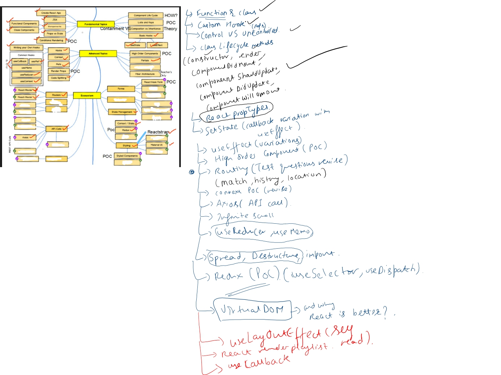
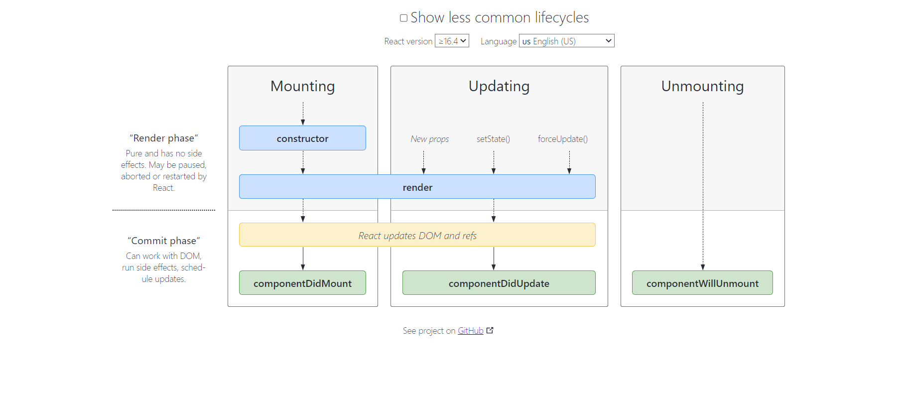
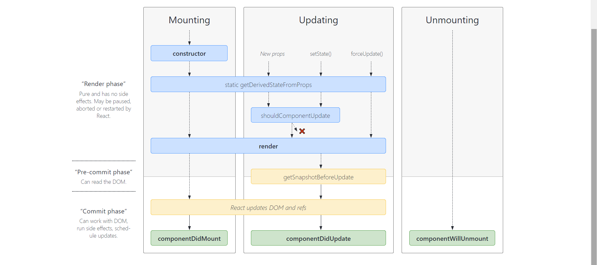
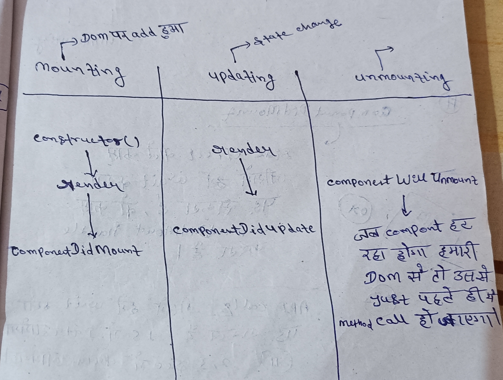

# react-interviews-question :

### Lifecycle method in react :
------------------------------------
- Three phases : (In class)

     - mounting(creation)   : 
       - aapka component aapke Dom par add huaa
           
              constructor() => render => componentDidMount
     - updating(updation)  :  
        - state change/update huyi toh component update huaa
             
              render => componentDidUpdate  
     - unmounting(delete) : 
        - Dom se nikal rhe
        - jab component hat rha hoga hamari Dom se toh uss se just pahle hi ye method call ho jayega.

               componentWillUnMount 






#### In functional component :

   - lifecycle wala kam function component me "Hook" k aane se "useEffect()" se solve karte h
   - side effect wale kam jisame hme wait karna pad sakta hai, wo kam hmm 
     functional component m "useEffect()" se handle karte hai. 

        - useEffect(fun) :
           
           - execute always after first render
        
        - useEffect(fun , [ ]) :
             
             - execute only once
        
        - useEffect(fun , [...parameter...]) :
            
             - unn parameters k , conditionally after first render


#### note:
    
    1- componentDidMount   ====alternate====>   useEffect(fun,[ ])

    2- useEffect(fun) => eska alternate class component m nhi hota.
    
-----*********** -----***********---------   




##### componentDidMount :
  - side effect wale kam, jisme hme wait karna pad sakta hai , wo kam componentDidMount handle karta hai [In class component]. 
  
  ```js
   class Component extends React.Component{
      constructor(){

     
      }

      componentDidMount(){

     
      }

      render(){

      
      }

   }


   // pahle constructor chalega then render then componentDidMount.
  ```

  - API calls => jisme hame wait karna pad sakta hai ,
    1 sec / 2 sec / 3 sec me data aayega.
    jisme hme async- await lagana padega.

  ```js
   async componentDidMount(){ // lifecycle me ek bar chalta hai aur data la kar de deta hai.

      const res = await axios.get(`.......`)
      
      let mData = res.data
      
      console.log(mData)
   }


   
   // axios ek promised libery hai toh esko promise k term me likhana thoda complex 
   // hota hai , toh kyun na async-await use kar liya jaye.

   // jisme hame wait karna pad rha ki data 1 sec / 2 sec / 3 sec me data aayega.
  //  toh hme async- await use kiya. componentDidMount k sath.

  // axios : server par request k liye
  ```  
  
 