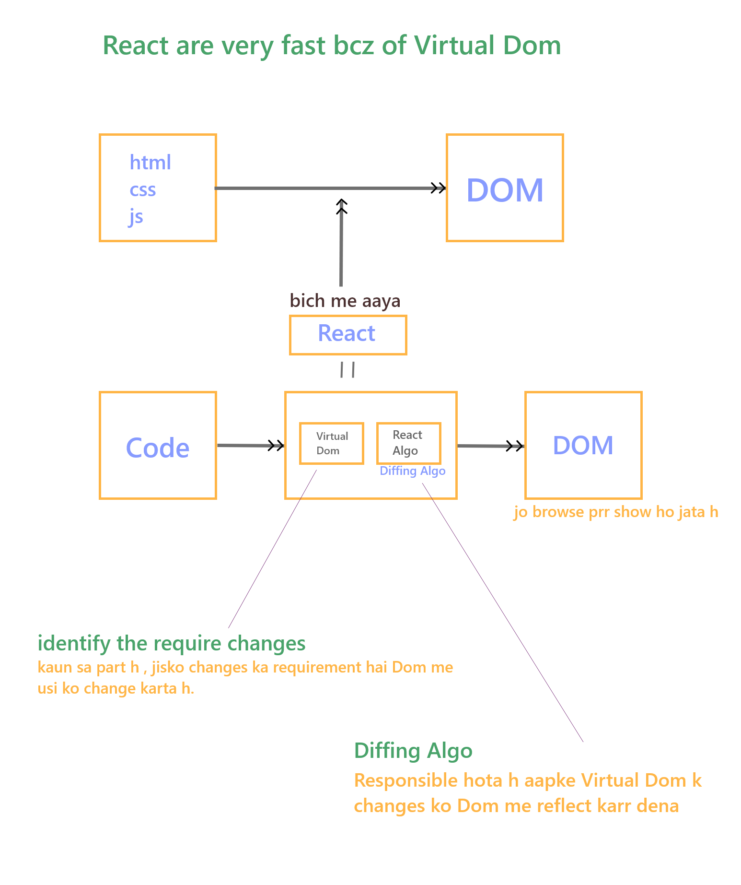
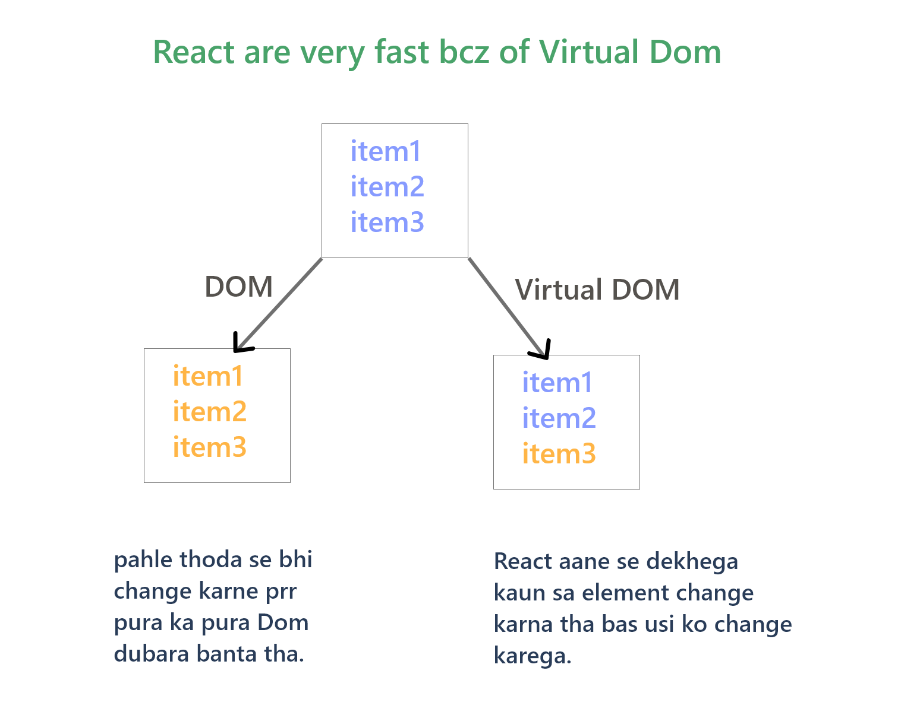
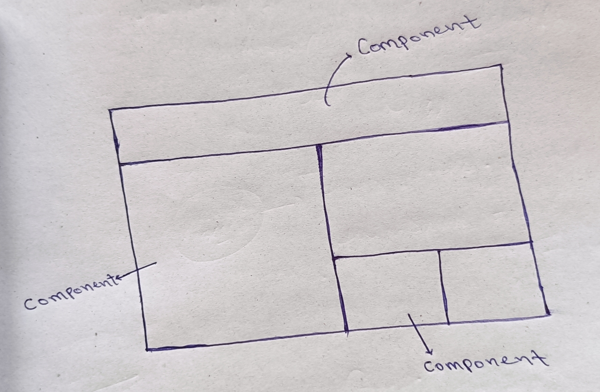

# React
   
   - React is Fronted library,
    which is used to build fast & efficient UI/UX.

   - It is develop by FB/Meta. 
   - DOM [O(n^3)] kam ko React [O(n)] me kar k deti h.

## why React ?

  - very Fast.


           
   



  - easy event handling
        
        eg. addEventListner() : DOM me 

         - sortcut provide karta react  

   - it's small library.

         It's easy to learn  

   - It manage UI by state.

   - react uses something called as Virtual Dom.    

   ----------------------     
-----------------------
----------------------
#### Framework:
     
       ek particular tools jisme sari chije mil jati h. 
       kisi chij prr dependency jiski kam ho wo hota h Framework. 

 #### Library:  

     Jisaki dependency jada ho , uske liye aapko tools dhudhane padegen , 
     uske liye aapko cheeje install karni padegi wo hoti h Library.   


 ################################################    
### Dom prr kaise karte h

 ```js
 FileName - index.html


<!DOCTYPE html>
<html lang="en">
<head>
    <meta charset="UTF-8">
    <meta http-equiv="X-UA-Compatible" content="IE=edge">
    <meta name="viewport" content="width=device-width, initial-scale=1.0">
    <title>Document</title>
</head>
<body>

    <div id="root">

    </div>
    
</body>

<script>
        //DOM me

        let ele = document.createElement("h1")
        ele.innerHTML='hello'

        let root = document.getElementById('root')

        root.appendChild(ele)


        // React me


</script>

</html>

```


### react me kaise karte h 
 
 - pahle do cdn link jodte h 

     - 
     ```js
      <script crossorigin src="https://unpkg.com/react@18/umd/react.development.js"></script>
      <script crossorigin src="https://unpkg.com/react-dom@18/umd/react-dom.development.js"></script>
      ```

      -
      ```js
        FileName - index.html
         
      
                        <!DOCTYPE html>
                        <html lang="en">
                        <head>
                        <meta charset="UTF-8">
                        <meta http-equiv="X-UA-Compatible" content="IE=edge">
                        <meta name="viewport" content="width=device-width, initial-scale=1.0">
                        
                        <script crossorigin src="https://unpkg.com/react@18/umd/react.development.js"></script>
                        <script crossorigin src="https://unpkg.com/react-dom@18/umd/react-dom.development.js"></script>
                        
                        <title>Document</title>
                        </head>
                        <body>

                          <div id="root">

                          </div>
                        
                        </body>

                        <script>
                              //DOM me

                              // let ele = document.createElement("h1")
                              // ele.innerHTML='hello'

                              let root = document.getElementById('root')

                              // root.appendChild(ele)


                              
                              
                              // React me

                              
                              let ele = React.createElement('h1',{
                                    children:['hello']
                              })

                              //  console.log(ele)

                              ReactDOM.render(ele,root)


                        </script>

                        </html>
                        

                  
                  
                  
                  #####  **NOTE**:
                        -------------
                              etna sara Tam-Jham esse axa toh Dom tha.

                              phir hmm aise kyun kahte h react easy h.... basically react easy h 
                              esi chij ko easy way m karna h toh hmm JSX use karegen.

                              JSX React me aap k kam ko easy banata h.

      ```       

### JSX 

   - eska use karke React me hmm aasani se code likh sakte h
   
   - eska alternative : 
           
     - swc transpilar
     - webpack

   - eg.
          
          function Element(){

             return(

                   <h1>Hello</h1>
             )
          }

     -         return k ander JSX likhe h   
 
-     JSX = js + html   
-     JSX stands for JS XML
-     It allows us to write HTML inside javascript and place them in the DOM 
      without using function like... appendChild() or createElement()

      as stand in the offical docs of React , jsx provides syntactic suger for
      React.createElement()


- ```js

            <!DOCTYPE html>
            <html lang="en">
            <head>
            <meta charset="UTF-8">
            <meta http-equiv="X-UA-Compatible" content="IE=edge">
            <meta name="viewport" content="width=device-width, initial-scale=1.0">
            
            <script crossorigin src="https://unpkg.com/react@18/umd/react.development.js"></script>
            <script crossorigin src="https://unpkg.com/react-dom@18/umd/react-dom.development.js"></script>

            //search: babel cdn link=> ye browser ko JSX samajh nhi aati toh JSX ko JS me /convert karti h 
            <script src="https://unpkg.com/@babel/standalone/babel.min.js"></script>

            <title>Document</title>
            </head>
            <body>

              <div id="root">

              </div>
            
            </body>

            <script type="text/babel">
                 
                  
                  
                  // React me

                  
            //      let ele = React.createElement('h1',{
            //         children:['hello']
            //      })

            //    //  console.log(ele)

            //     ReactDOM.render(ele,root)


            

            // JSX : eska use krr k React m asani se code likh sakte h

            function Element(){
                  return(
                  <h1>Hello</h1>
                  )
            }


            ReactDOM.render(<Element/>,document.getElementById('root'))


            </script>

            </html>

        
        
        
        --------************************************************************---------------------


            NOTE: 
                   
                  1-  Browser ko JS samajh m aati h pr JSX nhi 
                      toh "babel" tool  JSX ko JS me convert karti h


                  2- Search : babel cdn link 


                  3- jha hmm <script></script> likhate h uska type="text/babel"
                      kar dete h
                    
                           eg.   <script type="text/babel">

                                 </script>
                  

                  4- Component ka nam hamesa CAPITAL latter m hota h.  [i.e Element]

                     eg.   

                        function Element(){
                           return(
                              <h1>Hello</h1>
                           )
                        }

                        ReactDOM.render(<Element/>,document.getElementById('root'))
  ```

  ### Rules of JSX:
   
    - No Variable declaration.
    - No function declaration.
    - No loop (for,while,...)    --------> Map/Filter
    - if-else not allowed ----------> Ternary operator
    - Object ko render nhi kra sakte ---------> Array render kar sakte h.


#### Note :

       React k ander ek se jada element/obj k liye 
           
             1-    <div>
             
                   </div>


                   or

            2-    <React.Fragment>                        <>
                                            or      
                  </React.Fragment>                       </>


       
       use karte h.        


## Components :

-       It is basically isolated, reuseable, independent pieces of code.


      ye pieces of code hme return karta h - JSX
      aur ye JSX ham apne UI par render kra dete hai.   
            
 
 -   kisi particular website ko parts m divide karna ,, website k jitne parts hai,
     unko aap ek ek Component ki tarah treat kare.
     [parts m break karna i.e Component h]
  

 
 - Two types of Component :
        
      - class Component
           
            - stateFull : mtlb esme state define kar sakte h.

            - Dynamic UI
            - react v-16 se pahle : jha "state" hai, wha hme class-based component use karne hote the.
            
      - functional component
      
            - StateLess - pahle , 
              but after Hooks in functional component hmm apne state ko define kar sakte h.
              useState() se

            - static UI pahle, after Hooks it is also Dynamic UI
            - react v-16 se pahle : jha state se deal nhi karna hota , "parent" se data mangana ho toh functional component use karte the.

-  class component vs functional component :

   - class component :
     ------------------
       ```js
         class Component extends React.Components{
           
            constructor(){
                  
                  super()
                  
                  this.state = {
                        ..............
                  }
            }

            //yha function def krr sakte h
            ----------------------------------
            // yha [class component m] fun define karte samay hme "function" keyword nhi lena hota h.
            //  i.e function increment(){} 💨  increment = ()=>{} .
            

            render(){
                  
                  // yha koi bhi logic likh sakte h
                  
                  return(
                        //JSX
                  )
            }
         }

       ```
       
       ```js
       #index.js file
       ----------------

      import React from 'react'
      import  ReactDOM  from 'react-dom'
      import './index.css'


      class App extends React.Component{
      render(){
            const name = 'shashi'
            return(
            <h1>hello {name}</h1>
            )
      }
      }

      ReactDOM.render(<App/>,document.getElementById("root"))


      -------------------------------------
      
      #output:
               hello shashi

       ```
       - state define :
             
             this.state={
                  ..............
             }

        - state set [value set karana ho toh] :

                     this.setState({
                        .................
                     })
      - props access in class component :


             this.props.name


        ```js
           # index.js
           ----------------


            import React from 'react'
            import  ReactDOM  from 'react-dom'
            import './index.css'


            class AddTask extends React.Component{
                render(){
                        return(
                            <div>Add a Task</div>
                        )
                }
            }


            class TaskList extends React.Component{
            render(){
                  return(
                        <>
                        <div>{this.props.purpose}</div>
                        <div>{this.props.desc}</div>
                        </>
                  )
            }
            }


            class App extends React.Component{
                  render(){
                      return(
                         <>
                          <AddTask/>
                          <TaskList purpose='task to do'  desc='abcd'/>
                          <TaskList purpose='finished tasks' desc='efghij'/>
                        </>
                        )
                  }
            }

            ReactDOM.render(<App/>,document.getElementById("root"))

        ```  
   - functional component :
     ---------------------------
        
        ```js

         function Component(){

             return(
                   //JSX
             )
         }
        ```
        - state define :

                 const[state,setState] = useState(0)

       -   set state :  
           
               setState(....)
                         🔺
                         🟫updated value dal degen
                       
                  
                       
       - props access :

               props.name


### state :

   - It is nothing but an "object".  esme data aate h
   - "state" k ander aap properties ko " key:value " pair m pass krr sakte h.
   - jo bhi tumhe "UI m changes" karne hai, usko state m put karegen.

### render :
    
  -  "displayed of UI". ✨
  -  whenever state is changed , re-render is called.
  -  render method describe what should be displayed & how should the UI look like.

### super :
   
   - "super" se hmm "Parent class ki properties" ko access krr pate h.
    
    - access the property from parents.

    - parent ki "properties" access krr k deta h "value" nhi.
   - "React.Component" mera Parent class h. Component mera child class.
   - super se hme class ka "this" milta h.

   
     
```js
       
       class Component extends React.Components{
           
            constructor(){
                  
                  super()
                  
                  this.state = {
                        ..............
                  }
            }

            //yha function def krr sakte h 
            --------------------------------
            // yha [class component m] fun define karte samay hme "function" keyword nhi lena hota h.
            //  i.e function increment(){} 💨  increment = ()=>{} .
            

            render(){
                  
                  // yha koi bhi logic likh sakte h
                  
                  return(
                        //JSX
                  )
            }
         }
```
### props :  

 - jab hmm Component m argument bhejne ki bat karte h, toh usse props kahte h.
 - props means i.e properties.
 - pass data from one component to an other component [parent comp to child comp].
 - props ko {} 💨 esme pass karte h.


